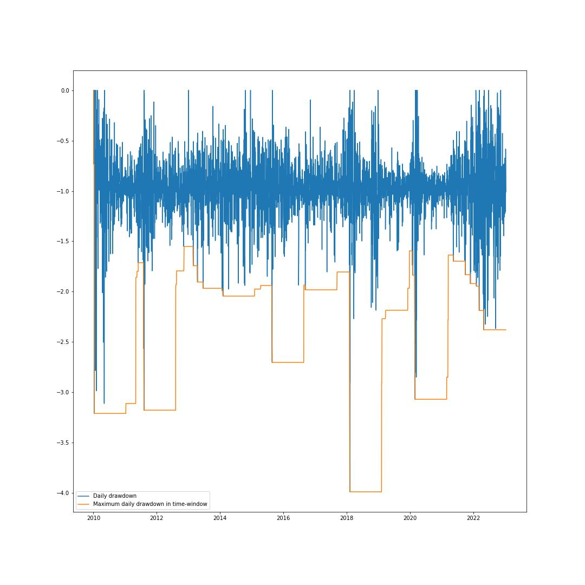
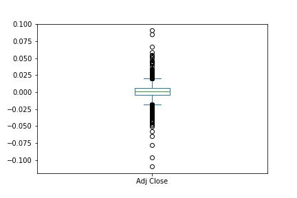
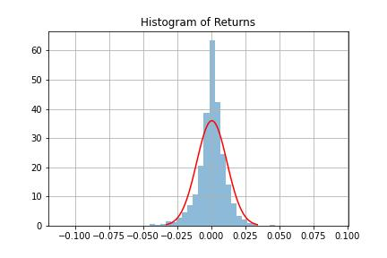

# Long-Term SPY
Financial Analysis Portfolio
If you're a long-term investor, any time is a good time to buy SPY stock. Given how diversified it is, SPY is the ultimate "set it and forget it" stock. Over the long term, the S&P 500 has returned 9.9% a year on average since 1928 including dividends!

This project provides Financial Analysis of a specified stock over a given time period. The project calculates and displays various financial metrics such as Returns, Volatility, Sharpe Ratio, Sortino Ratio, and Drawdown. It also plots a few graphs to visualize the data. The purpose is to provide a overview of the performance of the stock and help make informed investment decisions.

---

**Libraries used for data analysis and visualization:**

numpy

pandas

matplotlib

seaborn

tabulate

math

scipy

warnings

yfinance

datetime

relative delta

---

## Step 1: Get Data
Download the data for a specific symbol over a given time period using the Yahoo Finance API. 

Then calculates various statistical measures for the stock data, including the total return, annualized return, annualized volatility, Sharpe ratio, sortino ratio, maximum drawdown, and Calmar ratio.

## Step 2: Find the extremity of the dataset
Use pandas built in min() max() functions to identify the max and min price of the stocks adjusted close price. 

---

## Step 3: Initialize
Convert the inputed start and end dates to date time format using the datetime function from the datetime module, ensure the format is correct by enforcing the ymd

Establish the initial starting capital used to invest.
This example assumes you purchased from the first day of the data.

Calculate the beginning value and current value of the investment in the stock.

---

## Step 4: Calculations
Calculate various statistical measures for the stock data.

Calculate: 
- the daily cumulative returns, mean, standard deviation, skewness, and kurtosis of the returns data. 

- the total return and annualized return, and annualize the total return over a 12 year period. 
Total return: the overall gain or loss of the investment, expressed as a percentage of the initial investment

Annualized return: the total return of the investment, annualized to allow for comparison to other investments with different time frames

- the Sharpe ratio which compares the return of an investment with its risk. It does this by first subtracting the risk-free rate from the portfolio's rate of return, then divide the result by the standard deviation of the portfolio's excess return.

- the Sortino ratio, which is a risk-adjusted measure of return that takes into account the downside risk of the investment. It does this by calculating the expected return and standard deviation of the downside returns (returns that are less than a specified target).

Sortino ratio is a variation of the Sharpe ratio that only considers downside risk (i.e., returns below a certain target)

- the maximum drawdown of the investment, which is the maximum percentage loss from a peak to a trough, and the Calmar ratio, which is the annualized return divided by the maximum drawdown.

---

## Step 5: Visualization

**Daily Cumulative Returns**

**Returns Boxplot**

**Histogram of Returns**

---

## Step 6: Value at Risk Confidence
Using the built in quantile method, calculate the 99%, 95% and 90% values at risk confidence

---

Provide a comprehensive analysis of the performance of an investment in a specific stock that can be used to compare the investment's risk and return to other investments or to a benchmark index.